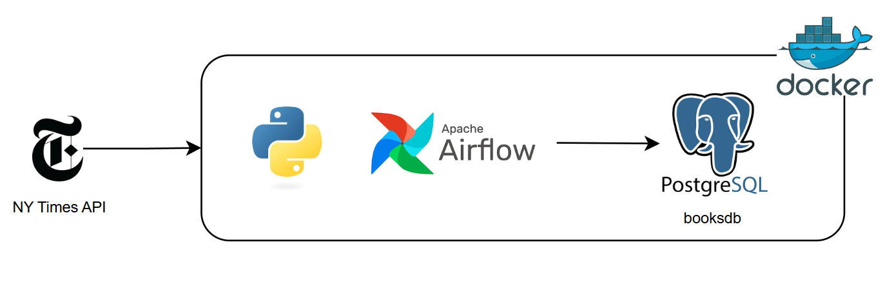
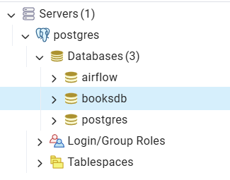

# NY Times Best Sellers Data Pipeline

A simple data pipeline that moves data from New York Times API to PostgreSQL with Airflow and Docker.

The objective of the project is to build an automated ETL data pipeline that collects weekly data from the New York Times API using Apache Airflow. The data is stored in a PostgreSQL database for analysis. The entire system is deployed in Docker containers, ensuring portability and easy maintenance.

## Description

### Dataset

The [New York Times](https://developer.nytimes.com/) Books API provides an overview service to get all the Best Sellers lists for a given week. The lists are published on Wednesday around 7 pm US Eastern time. 

For our purpose, the orchestration workflow is scheduled to run once a week after the New York Times API publishes new data, and it only takes the most recent. It's possible to implement an incremental load in the Postgres database to cumulate the data and apply historical analysis.


This project uses data from the New York Times Books API. Usage is subject to the Developer Terms of Use, and attribution to NYT is required for any publication or visualization of the data.

### Tools and Technologies

- Python
- PostgreSQL
- Airflow
- Docker

### Data Architecture



## Process

### Pre-requisites

- Get started with NYT Public API -> [Steps](https://developer.nytimes.com/get-started)

- Make sure you've installed and running [Docker Desktop](https://docs.docker.com/desktop/) or [Docker Engine](https://docs.docker.com/engine/install/)

### Initialize Services

- Clone git repo
  ```
  git clone XXX
  cd amazon-books-data-pipeline
  ```

- Initialize airflow database
  ```
  docker compose up airflow-init
  ```

- Start services
  ```
  docker compose up
  ```

- In a second terminal check that the docker containers status is healthy
  ```
  docker ps
  ```

### Settings

**pgAdmin**

- Log in to [pgAdmin](http://localhost:5050) with Username: `admin@admin.com` and Password: `root`.
- On the left pannel, right click on Servers --> Register --> Server
- On General tab, enter Name: `postgres`
- On Connection tab, enter Hostname: `postgres`, Port: `5432`, Username: `airflow`, and Password: `airflow`
- You should be connected to Postgresdb from pgAdmin and see the database `booksdb` created automatically
  
     

**Airflow UI**

- Log in to [Airflow UI](http://localhost:8080) with `airflow` for both your Username and Password
- Select Admin tab --> Connections --> Add Connection
- Enter Connection ID: `postgres_nytimes_connection` and Connection Type: `postgres`
- Enter Host: `postgres`, Login: `airflow`, Password: `airflow`, Port: `5432`, and Database: `booksdb`
- Select Admin tab --> Variables --> Add Variable
- Enter Key: `nytimes_api_key` and as Value your api key value provided by NY Times API.

### Run Pipeline

- On Airflow UI, select the DAG and click on Trigger.
